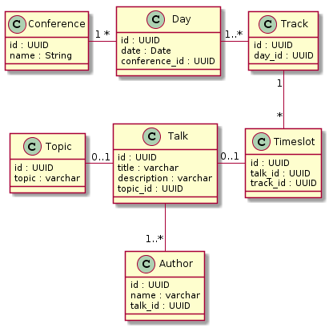

[](https://travis-ci.com/Westerdals/pgr200-eksamen-asmadsen)

# Gruppe: 
* Kjell-Olaf Slagnes: slakje17
* Andreas Storesund Madsen: madand18


### Evaluation and other docs in doc folder


## Testing the server and client

The server runs on port 8080, so make sure nothing else uses this port.
```
Compile and run tests:
mvn clean package

Edit innlevering.properties with login and database connection string
innlevering.properties

The server needs to be started from the root of the project so the properties file
can be located and run the nessecary migrations.
Start the server:
java -jar server/target/conference-api-server-0.1-SNAPSHOT.jar

Start the client:
java -jar cli/target/cli-0.1-SNAPSHOT.jar

This is an interactive client. It will list the actions available and promt with followup questions.
```

## Client example run
```
java -jar cli/target/cli-0.1-SNAPSHOT.jar

Choose startingpoint
> Talks
(use arrow keys)

What action do you want to take?
  List
> Add
  Update
  Delete
(use arrow keys)

Talk title 
> Sockets
Talk description 
> How to use java sockets
Do you want to add a topic? (Y/n)
> y
Select a topic
> Create a new topic
(use arrow keys)

Topic name 
> Java

Do you want to do another action (y/N)
> y

Choose startingpoint
> Talks
(use arrow keys)

What action do you want to take?
> List
  Add
  Update
  Delete
(use arrow keys)

{
  "values": [
    {
      "id": "292cdb0c-32ff-42a4-9a41-f73defc64962",
      "title": "12",
      "description": "saasdas",
      "topic_id": null,
      "topic": null
    },
    {
      "id": "618604c5-e7f7-424a-abb9-90d8ad0f9f9a",
      "title": "Sockets",
      "description": "How to use java sockets",
      "topic_id": "a5cccc9f-c2d8-40e7-96c0-83c6dc6574dc",
      "topic": {
        "id": "a5cccc9f-c2d8-40e7-96c0-83c6dc6574dc",
        "topic": "Java"
      }
    }
  ]
}

```

### datamodell


